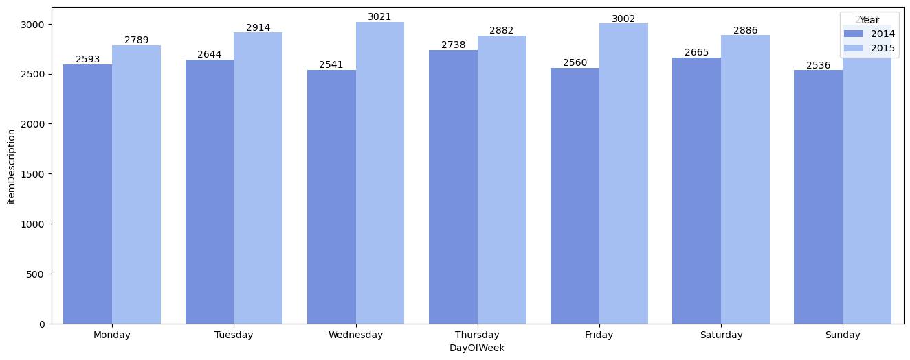
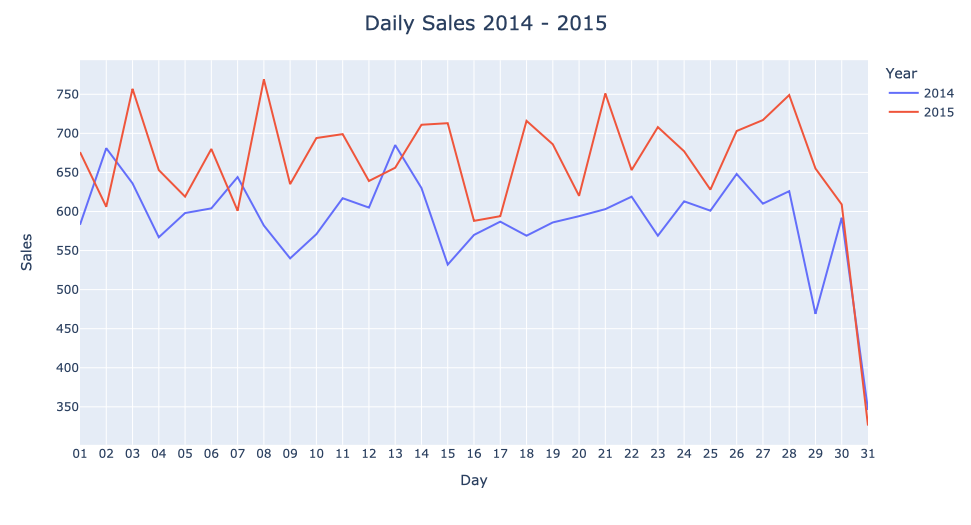
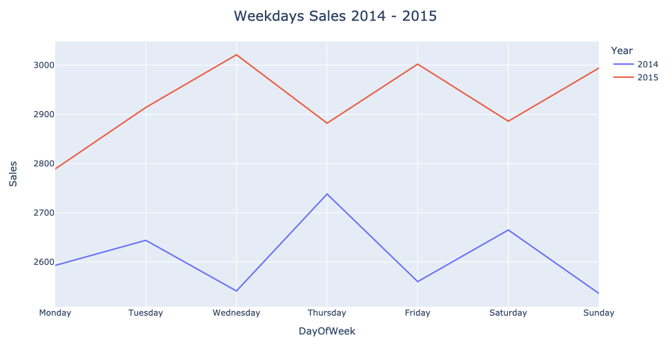
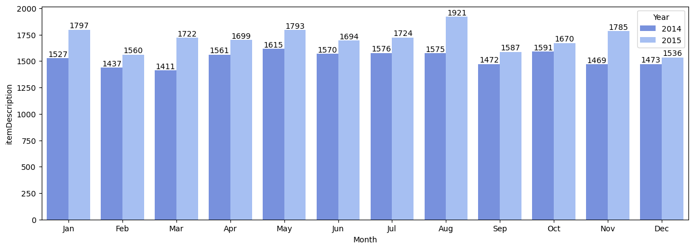
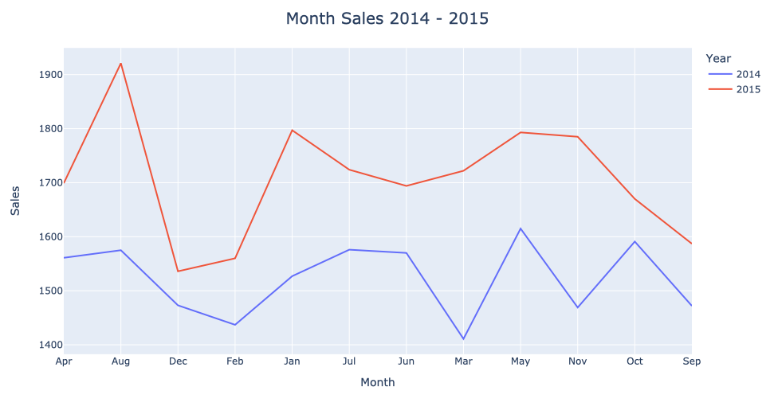
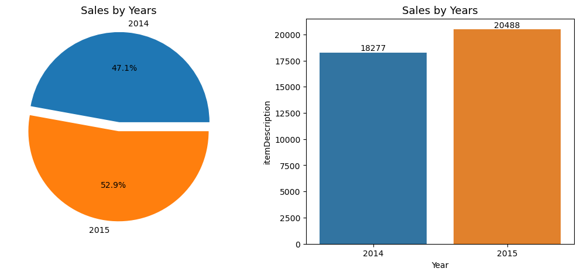

# market_analysis
Dataset source from Kaggle: https://www.kaggle.com/datasets/heeraldedhia/groceries-dataset

# Overview
Groceries market is widely utilized by a diverse demographic due to its accessibility and competitive pricing, particularly catering to the mid to low-income segments. To enhance business profitability, the implementation of an effective recommendation system is crucial. Customers typically purchase only what they need, however, as an entrepreneur, the objective is to encourage increased spending to maximize profits.

In pursuit of this goal, we can conduct a comprehensive analysis of customer behavior based on the purchase history within the time frame of 2014-2015. The analysis will be delves into Market Basket Analysis.

## Data Description
| Field          | Description                                                    |
|----------------|----------------------------------------------------------------|
|Member_number   | Unique identifier for distinguishing customers; this data will be used to observe and measure the success of market applications.                        |
|Date            | The date of purchases                                          |
|itemDescription | Description of the items they bought previously                |

- Rows: 38765
- Columns: 3
- Null values: 0

## Analysis Approach
Market Basket Analysis utilizing Apriori algorithm to research relationships between items in the dataset. The main purpose is to identify patterns or associations between variables in the dataset. Apriori require the following:
- **Support** - Measures the frequency of an item that appears in the data
   - A low support value implies insufficient information to draw conclusions.
- **Confidence** - Indicates how often the rule holds.
   - Confidence may be considered inaccurate for analysis when dealing with very frequent consequences, as it tends to be consistently high.
- **Lift** - Measure the ratio between confidence from association rules and support from itemset.
    -  Lift = 1 means there is no correlation in the set,
    -  Lift > 1 means there is a positive correlation in the set and
    -  Lift < 1 means there is a negative correlation in the set.

## Market Basket Analysis
### Frequencies Items Sold

The graph illustrates the 30 items with the highest purchasing frequency in the grocery market.

Frequencies of all items sold.

### Time Series
#### Day of Week

#### Months

#### Years

The graph illustrates the business performance on various days across different years. It is evident that Tuesdays in 2015 experienced higher purchase volumes compared to Tuesdays in 2014. The time series graph further reveals a consistent increase in sales over the years.

## Apriori
### Lift = 2 and Confidence = 35%

The graph depicts a product with a lift of 2 and a confidence level of 35%. This indicates that the product is more likely to be purchased together, as the lift is greater than 1, signifying a positive correlation for the product.

### Lift = 1 and Confidence = 70%

The graph depicts a product with a lift of 1 and a confidence level of 70%. In the analytical context, it's important to note that confidence values can be less accurate when dealing with highly frequent consequences. A lift value of 1 indicates no correlation between antecedents and consequences. However, when antecedents occur, there is a 70% chance that the consequence will also occur.

## Conclusion
Based on the data analysis, we can conclude that there was a 5.8% increase in grocery sales from 2014 to 2015. The business has exhibited positive growth during this period. To further enhance this growth, we can leverage the Apriori algorithm. By identifying product with a lift greaer than 1, indicating a positive correlation, we can strategically encourage customers to make additional purchases, thereby maximizing sales opportunities.
